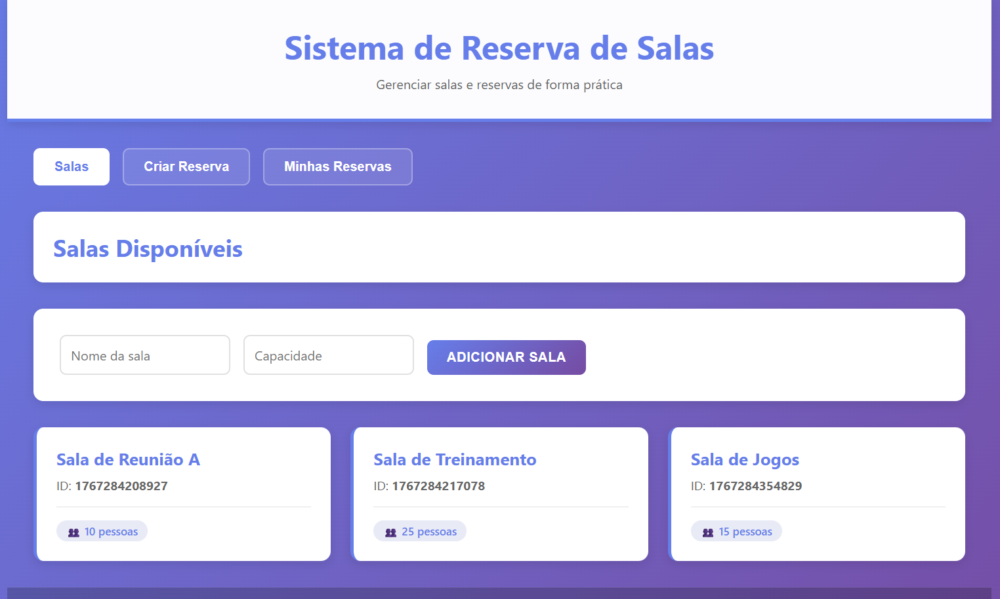
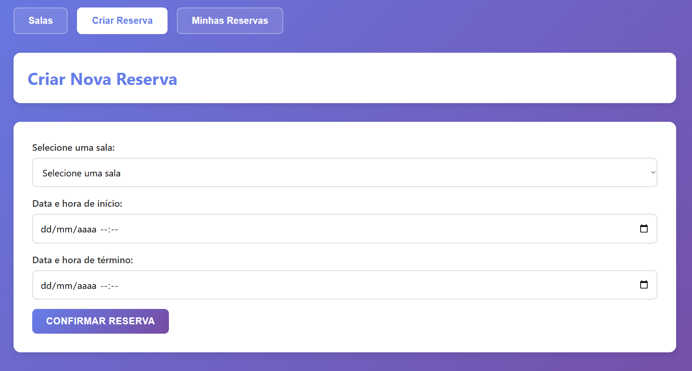
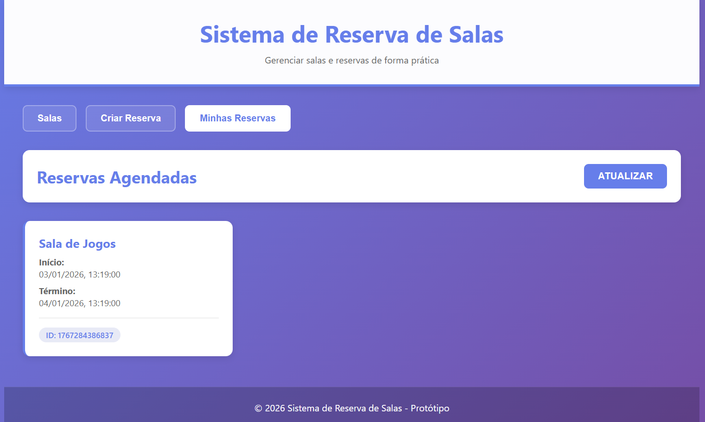

<p align="center">
  <strong>
    <a href="./README.md">Português</a>
    &nbsp;|&nbsp;
    English
  </strong>
</p>

# Room Booking System

Complete **room booking system**, developed in **Node.js**, featuring a well-structured backend, solid business rules, and a modern frontend for functional demonstration. This is a demonstrative project focused on **reservation logic**, **REST APIs**, and **critical business validations**.

---

## 🧠 Project Objective

This project was developed as:

- A functional prototype of a room booking system
- A demonstration of real-world business rules
- An example of a well-structured REST API
- A solid foundation for future evolutions  
  (e.g., authentication, relational database, permissions)

---

## 🛠 Technologies Used

- Node.js
- JavaScript
- HTML5
- CSS3
- JSON
- Git
- GitHub

---

## 📸 Demonstration

The images below represent the real operation of the system:





---

## 🚀 Features

### Backend (REST API)
- Organized structure using controllers, routes, and services
- Complete REST endpoints for rooms and reservations
- Mandatory backend data validation
- Prevention of reservation time overlaps
- Date validation (does not allow past reservations)
- Real-time conflict detection
- Proper HTTP error responses (`409 Conflict`)
- Functional JSON-based database (for prototyping)

### Business Rules
- A room cannot be reserved during conflicting time slots
- Conflicts are detected accurately
- Backend never allows invalid data
- Frontend properly reflects errors and successes

---

## 🎨 Frontend

- Modern and professional interface
- Gradient-based visual design
- Interactive tab system
- Responsive cards
- Intuitive forms with validation
- Visual feedback for success and error states
- Visual room selector
- Clear and organized reservation listing
- Interface fully available in Portuguese

---

## 🧪 Tests Performed

- GET `/api/salas`
- POST `/api/salas`
- GET `/api/reservas`
- POST `/api/reservas`
- Time conflict validation
- Accurate overlap detection
- Full frontend and backend integration
- Server running correctly

---

## ▶️ How to Run the Project

### 1️⃣ Install dependencies
```bash
npm install
```
### 2️⃣ Start the server
```bash
npm start
```
### 3️⃣ Access in the browser
```bash
http://localhost:3000
```
